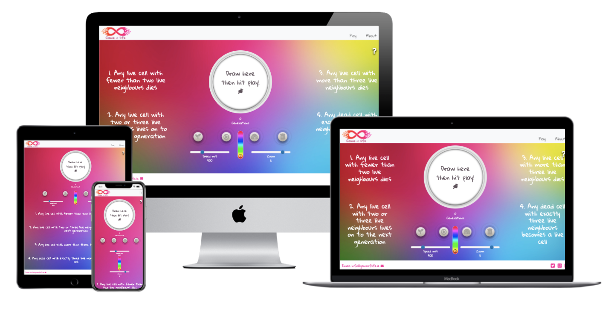
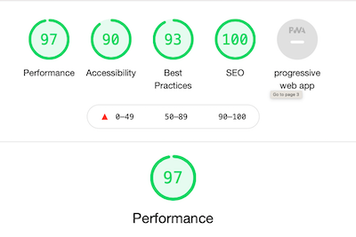

[![homepage][1]][2]

[1]:  assets/images/logogol3.png
[2]:  https://raymondkeogh.github.io/gameoflife/ "Redirect to homepage"





**GameOfLife Website**
==================
Table of contents:
-----------------


 - [Description](#description)
 - [User Experience](#user-experience)
     - User Stories
     - Strategy
     - Scope
     - Structure
     - Skeleton
     - Surface
 - [Technologies](#technologies)
 - [Testing](#testing)
     - Acceptance Criteria
     - Browser Compatibility
     - OS Compatibility
     - Devices Compatibility
     - W3 HTML Validation
     - W3 CSS Validation 
     - CSS Lint Validation 
     - Lighthouse Performance Test
     - Regression Testing
     - User Testing.
     - Bugs
 - [Deployment](#deployment)
 - [Credits](#credits)
     - Code Used
     - Content
     - Acknowledgements


Description
-----------

The GameOfLife is a cellular automaton devised by the British mathematician [John Horton Conway](https://en.wikipedia.org/wiki/Conway%27s_Game_of_Life) in 1970. It is a zero-player game, meaning that its evolution is determined by its initial state, requiring no further input. One interacts with the Game of Life by creating an initial configuration and observing how it evolves. It is Turing complete and can simulate a universal constructor or any other Turing machine.

The live site can be viewed [here](https://raymondkeogh.github.io/gameoflife/).

User Experience
--------------------

----------

**USER STORIES**

----------

**External User Goal:  (In order of priority):**

 1. As an external user I want to easily interactive with the game.
 2. As an external user I want to be able to start and stop the game easily.
 3. As an external user I want instructions on how to game works. 

**Site Owner Goal:**

 1. As a site owner I want to present a clean and engaging experience to the user.
 2. As a site owner I would like the user to interact easily with the site. 
 3. As a site owner I would like the user to return to the website and/or share it. 

The mockup for this site was done on Balsamiq Wireframes 
and can be viewed below 

- [Desktop Homepage](assets/images/wireframes/desktopHomepage.png).  
- [Desktop About Page](assets/images/wireframes/desktopAboutpage.png).  
- [Tablet Home Page](assets/images/wireframes/tableHomepage.png).  
- [Tablet About Page](assets/images/wireframes/tabletAboutpage.png).  
- [Mobile Home Page](assets/images/wireframes/mobileHomepage.png).  
- [Mobile About Page](assets/images/wireframes/mobileAboutpage.png).  


----------

**STRATEGY**

--------

 - **Focus:**  
    The main focus of this project was provide the user with an interactive experience allowing the user to manipulate elements on the screen. 

 - **Definition:**  
    While the website will have user controlled functionality it should be easy to use and intuitive. The user will be offered cues on element functionality but naming and location should allude to element function and interactivity.

 - **Value:**   
    Making this experience as fluid and intuitive as possible will ensure a good user experience, encourage interaction with the site and possibly sharing of the site with other potential users. 

----------

**SCOPE**

----------

**Features:** 


- **Navigation menu** – Two menu items which will be - Game Instructions, History/Theory of the game and a menu item returning to the main game screen. 

- **Canvas** – Editable canvas for drawing of initial state for the game.

- **Start button** – Start button to begin the simulation.

- **Pause button** – Pause button to pause the simulation.

- **Clear button** – Resets the canvas to an empty state.

- **Speed slider** – Alter the speed of the simulation.

- **Zoom slider** – Alter the magnification of the canvas.

- **Randomize button** – randomize the initial game state. 

- **Rainbow button** – Rainbow button that colours the game cells with random colours.

- **Color Chooser** – Option to choose the color of the game cells

- **Generation counter** – Displays the number of generations/cycles the Game has gone through. 


**Constraints:**  

Given more time and more experience working with Javascript I would be able to realise my initial vision of creating the laboratory desk space and a 'click to zoom' feature on the telescope to reveal the game of life canvas. On the desktop would be samples in petri dishes which would act as selectors for different patterns for the initial states in the Game of Life. 

----------

**STRUCTURE**

----------

1.	The Game - The homepage will contain the main game simulation and all of the controlling elements. It should be immediately apparent to the user how to interact with the site. There will be a canvas section that takes input from the users mouse or touch input to fill the arrays initial state. A small box will show the number of generations/cycles the simulation has completed. There will be buttons for 'Start' 'Pause', 'Clear', 'Randomize' and 'Rainbow' as well as a colour choosing element and a speed slider. 
    - As an external user I want to easily interactive with the game.
    - As an external user I want to be able to start and stop the game easily.
    - As a site owner I want to present a clean and engaging experience to the user.
 

2. The Menu - This will be located top right of the screen offering the user choices between 'How to Play' and 'About the game'. There will also be a third option which will lead the user back to the main game/home screen. 

   - As an external user I want instructions on how to game works. 
   - As a site owner I would like the user to interact easily with the site. 


3. The Footer - This will offer the user links to share the page to their social media outlet of choice. It will also allow the user to contact the developer in case of bugs but preferably in adulation. 

   - As a site owner I would like the user to interact easily with the site. 
  
4. 'About' Page - is will contain some text, images and a video detailing the game concept, the rules and some information about the creator of the game. The 'About' page will also have a navbar and a footer identical to the 'Homepage'. 

5. 'How to' modal - this will be displayed by clicking on a question mark icon in the top right corner of the screen. The icon should get the users attention by having a slight shaking motion to encourage them to click on it. The modal popup will show the various controls and how to use them as well as a link to the 'About' section for more information on the game.   

   - As an external user I want instructions on how to game works.

----------

**SURFACE**

----------

This is primarily a website for people to engage and enjoy the simulation so with that in mind the site will veer towards a more playful theme. The simulation itself is reminiscent of earlier computer game graphics and so retro themes can be employed to reinforce this. 

**Colours:** 

 - The colour scheme will be orange and pink repeating the Logo colour in the background and footer.  

**Typography:** 

 - Gloria Hallelujah will be used as the main font as it is playful yet easy to read. Cursive will be used as the backup font. 

**Effects:**

 - Buttons will have a shadow effect to give the appearance of a 3d button and the shadow will change to show the user when a button has been depressed. 

 - Hamburger style dropdown menu on mobile and table size screen will reveal the menu items. 

 - Edges on pictures will be softened with rounded borders and given depth with shadow effect. 

**Imagery:** 

 - The imagery used in the logo reflects the the presentation of the game of life with the cells tapering off at the edges.

 - The round screen around the canvas element should give the feeling of looking through the lense of a microscope. This effect is quite basic at the moment for reasons mentioned in the Constraints section. 

**Deviations from design:**

The initial idea for the game was to create a homepage that showed a top down view of a laboratory desk showing a microscope and some petri dishes. Clicking on the microscope would zoom into the canvas element that would give the impression of cells being viewed under a lense. This idea was simplified to a simple circular canvas element and a graduated colour background due to restraints on time and knowledge of Javascript. In future upgrades to the site these features may be implemented. 
The 'How to' page was taken from the design in favour or a more exploratory approach to the game encouraging the user to experiment and try different approaches. This design was reinforced with Popover messages guiding the user in the right direction.  


Technologies
----------------

 - [**HTML5**](https://en.wikipedia.org/wiki/HTML5) – I used HTML to create the websites main structures
 - [**CSS3**](https://en.wikipedia.org/wiki/CSS) – I will use CSS to style the components created with HTML and
   create the desired effects described in the ‘Surface’ section.
 - [**Bootstrap**](https://getbootstrap.com/) – I decided to use Bootstrap in order to create structures
   on the site and ensure responsiveness.
 - [**FontAwesome**](https://fontawesome.com/)  - The icons from this library are used for the
   navigation icons
 - [**Google Fonts**](https://fonts.google.com/) – Roboto and Holtwood One SC are imported from here.
 - [**GitPod**](https://gitpod.io/) – IDE used for working on my code
 - [**GitHub**](https://github.com/) – Used for hosting the files used for the website.
 - [**Git**](https://git-scm.com/) – Version control used to track changes, commit and push code to
   Github.
 - [**Lighthouse**](https://developers.google.com/web/tools/lighthouse) - Website performance testing utility found in Chrome DevTools. 
 - [**DevTools**](https://developers.google.com/web/tools/chrome-devtools) - I used Chrome DevTools throughout the development of the site to modify elements on the screen live, testing screen responsiveness, debugging code and access to the [Lighthouse](https://developers.google.com/web/tools/lighthouse) utility. 
 - [**StackEdit**](https://stackedit.io/editor) Used to help in the creation of this Readme file.
 - [**Pixlr**](https://pixlr.com/e/) - used for editing images for the website and creating png files.   
 - [**W3 HTML Validation**](https://validator.w3.org/) - Online HTML validation tool. 
 - [**W3 CSS Validation**](https://jigsaw.w3.org/css-validator/) - Online CSS validation tool.
 - **Gitpod extensions:**
     - Auto Close Tag
     - Bracket Pair Colorizer
     - Code Spellchecker
     - Prettier - Code Formatter
     - Indent-Rainbow
 - [**Techsini**](http://techsini.com/multi-mockup/index.php) - I used this website to create a multi mockup of the live website display at the head of my Readme file. 
 - [**Brackets**](http://brackets.io/) - Local IDE.
 - [**Autoprefixer**](https://autoprefixer.github.io/) - Parses CSS and adds vendor prefixes.
 - [**Google mobile-friendly Test**](https://search.google.com/test/mobile-friendly?id=PM7sy6dG9tEXLsvHooNW6Q) - Tests for mobile compatibility. 
 - [**Weppagetest.org**](https://www.webpagetest.org/result/201121_DiAZ_f0035ae75885410bc1ba7907017673b9/) I used this website to run speed tests from multiple locations around the globe using real browsers (IE and Chrome) and at real consumer connection speeds.

Testing
-------

**Acceptance Criteria:**

1. All links on the website must connect to the correct location.
2. All images and elements on website must load correctly.
3. All fallback fonts must work visually should the first choice fonts be unavailable.
4. All elements on the website must be responsive, resizing for different screen sizes and maintaining their integrity with no overlapping.
5. All external links direct to the correct website.
6. The website loads correctly and functions on Chrome, Internet Explorer, Safari and Firefox browsers.
7. The website performs as required as outlined in User Stories for external users and the site owner.


All testing is documented and can be viewed in the following formats. [Mac Numbers](assets/testing/GOLtesting.numbers), [Excel](assets/testing/GOLtesting.xlsx) and [PDF](assets/testing/GOLtesting.pdf).


**Browser Compatibility**

| Screen Size/Browser  | Chrome  | Internet Explorer  | Safari  |  Firefox | Opera |
|---|---|---|---|---|---|
|  Mobile |✅   | ✅  | ✅| ✅ | Not tested |
|  Desktop | ✅  | ✅  | ✅  | ✅  | Not tested |
|  Tablet | ✅  | ✅  | ✅  |  ✅ | Not tested|

**OS Compatibility** 

The OS used during testing were: 
- Mac OS 11.0.1 
- Windows 10
- Android (OxygenOS Version 9.0.6)
- iOS 14.4.1
- Xcode Simulator - iPhone 12 Pro Max, iPad Pro 12.9inch

Further testing yet to be carried out on Linux and Unix.

**Devices Compatibility** 

The devices used during testing were: 
- Macbook Air 13inch 2017
- Acer Chromebook cb3-431
- Oneplus 3T 
- Oneplus 5T
- Pixel 4a
- iPhone X 
- iPhone SE 
- HP Elitebook G5 
- iPad 10.2
- Dell Optiplex 7480.
- Clevertouch Interactive 75" Display

**W3 HTML Validation** was done via [https://validator.w3.org/](https://validator.w3.org/).

This was completed with no errors or warning showing.

**W3C CSS Validation** was done via [https://jigsaw.w3.org/css-validator/](https://jigsaw.w3.org/css-validator/)

I received warning mostly about vendor extensions added by Autoprefixer. There were two errors which I was unable to resolve without breaking the code. 

```
306 input[id="rainbow"]:checked ~ label i	Value Error : background is an incorrect operator 
308 input[id="rainbow"]:checked ~ label i	text is not a background-clip value : text 
``` 


**CSS Lint Validation** was done via http://csslint.net/

I received the following errors which could not be removed without breaking the code. 
```
41	5 Parsing Errors Expected RBRACE at line 41, col 5.
--bs-gutter-x: 0;

486	5	Parsing Errors	Expected RBRACE at line 486, col 5.
--bs-gutter-x: 0;

711	5	Parsing Errors	Expected RBRACE at line 711, col 5.
@-webkit-keyframes bounce {

754	1	Parsing Errors	Unexpected token '}' at line 754, col 1.
```

**Lighthouse Performance Test** 

The perfomance of the site on Lighthouse can be viewed [here](assets/testing/lighthousetest.pdf). 



**Regression Testing**

Any new features and bug fixes were submitted to regression testing of all functional and non functional aspects of the project to ensure that previously developed and tested software still performed following changes. 


**User Testing**

I used most of my family and friends for this section of the testing with the only instruction given was to be brutal with their use of the site and unforgiving with their criticisms. The testers ranged in age from 7 to 75. One of the main comments was that they weren't quite sure what to do or how to "win" the game. This prompted me to make the instructions more accessible and the information icon in the top corner will animate after 5 seconds to ensure it catches the users attention. In these instructions I tried to make the nature of the site as clear as possible. I also noted that some of the users did not know there were more controls below the main screen when on mobile. This was fixed with an animated arrow icon at the bottom prompting the users to scroll down. Some other helpful inputs from users involved compatibility issues with their devices. These are documented in the bugs section below. 

**Bugs**


+ **Bug:** When scrolling on mobile the drawn on cells disappear then sometimes reappear. When clicking play the cells reappear.  
**Fix:** Add eventlistner to onscroll that calls the drawCell() function. 

+ **Bug:** Canvas not drawing on Safari on iOS, Mac, Firefox Mac and Windows.  
**Fix:** Changed the draw function to contain no zero length moves and draw with arc function. Solution found [here](https://stackoverflow.com/questions/64005001/drawing-point-on-canvas-not-working-on-safari). 

+ **Bug:** Tooltip displaying over modal after clicking modal button on mobile.    
**Fix:** Added query to hide tooltip on click.   

+ **Bug:** Canvas not resizing on screen refresh.     
**Fix:** Added eventlistener for screen size change.  

+ **Bug:** Start/Clear button combo alert loop.    
**Fix:** Used if statement to prevent loop.  

+ **Bug:** SetInterval running before start clicked.    
**Fix:** Changed location of setInterval being called.   

+ **Bug** Momentum scrolling not triggering the redraw of the canvas thus leaving a blank white canvas after the scroll.   
**Fix** Added a timer to scroll event to ensure that even if momentum scrolling was in effect the timer would catch any events.

+ **Bug** Canvas blanking during zoom.   
**Fix** Added if statement to "Pause" the simulation during zoom transitions.

+ **Bug** Cells cycling through states when zooming.   
**Fix** Change the zoom function to use the drawCells() function instead of step() function to redraw the cells after zoom completion.

+ **Bug** The canvas message div that was layered over the canvas was catching the first touch/click event and stopping the canvas from receiving this event.  
**Fix** I created three layers, a white background layer, the message layer and then a transparent canvas layer. This ensure the canvas was always on top and received the initial touch/click event. 

+ **Bug** Toolip displaying over modal when click on mobile.   
**Fix** Added event listener to hide the tooltip once clicked. 


Deployment
----------

The following steps were taken to deploy the website. 
1. Create a GitHub account at [https://www.github.com](https://www.github.com). locate the GameOfLife repository for the website. The link is here. [https://raymondkeogh.github.io/gameoflife/](https://raymondkeogh.github.io/gameoflife/) 
2. Click on the setting cog in the centre right near the top of the page. 
3. Scroll down to the section that says GitHub Pages. 
4. Ensure 'branch: master' is selected.
5. Click 'Save' 
6. The site link will be displayed above this section where is says  'Your site is published at - .....'
7. Click the link to open the website in a new tab and the website is deployed!

More information on github pages can be found [here](https://pages.github.com/).

In order to run this project there a couple of methods you can use. The first is for use with a cloud based IDE called Gitpod and the second is for use in a local IDE of your choice e.g. VSCode.  

**Run in Gitpod:**

1. Create a GitHub account at [https://www.github.com](https://www.github.com). 
2. Install the gitpod browser extension for Chrome browser.
3. Restart the Chrome browser.
4. Log into [GitPod](https://www.gitpod.io/) using your GitHub account. 
5. Next open GitHub and locate the GameOfLife repository for the website at [https://raymondkeogh.github.io/gameoflife/](https://raymondkeogh.github.io/gameoflife/)
6. Click on the green GitPod button in the top right hands side of the screen. 
7. This will open a new GitPod workspace with the GameOfLife respository files in it. 


**Run in Local IDE:**

1. GitHub and locate the GameOfLife repository for the website. The link is here. [https://raymondkeogh.github.io/gameoflife/](https://raymondkeogh.github.io/gameoflife/). 
2. Click on the the button near the top of the page that says "Code". Note. If you are following these steps on the mobile site you will need to enable 'Desktop mode' on your mobile browser in order to see the "Code" button. 
3. In the box that pops up under the HTTPS section copy the URL. 
4. In your local IDE open the command terminal. 
5. Change the working directory to the location where you will be working on the project. 
6. Type in 'git clone' and the url you got from the HTTPS popup from the code button. 
7. Press enter to create you local clone. 
8. Best of luck!


Credits
-------

**Code used**

How to customise icon colour. 
https://stackoverflow.com/questions/52578726/fontawesome-5-multi-color-icon

Mobile touch events tutorial
https://mobiforge.com/design-development/html5-mobile-web-touch-events

Slider controls
https://seiyria.com/bootstrap-slider/

Tutorial on matchMedia
/https://stackoverflow.com/questions/49989723/how-can-i-force-a-matching-window-matchmedia-to-execute-on-page-load

Tutorial on implementing Game of Life
https://www.youtube.com/watch?v=0uSbNMUU_94

Colour slider 
https://www.cssscript.com/sleek-html5-javascript-color-picker-iro-js/#basic


**Content**

Infinity image used in logo 
https://es.123rf.com/photo_80611847_infinity-icon-elemento-de-dise%C3%B1o-del-logotipo.html

About Page information
https://en.wikipedia.org/wiki/Conway%27s_Game_of_Life


**Acknowledgements**

I would like to thank:

- My mentor Maranatha Ilesanmi for his encouragement, excellent guidance, time and support. 

- My friends and family for being my unwilling testers. 

